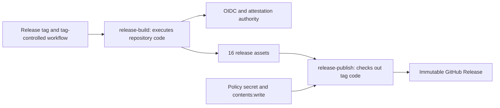
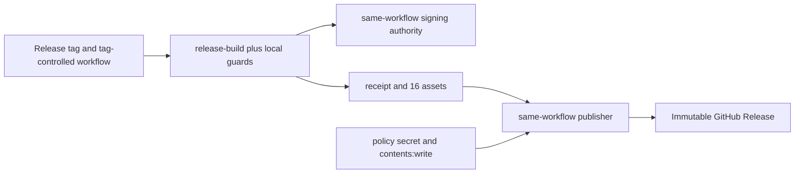
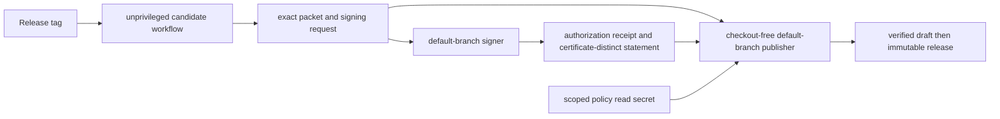
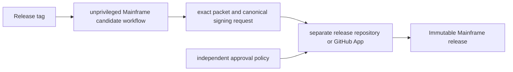

# Security Hardening Proposal: Split Release Authority From Candidate Code

## Decision

We need to choose where Mainframe's attestation and publication authority
lives. The current workflow has excellent byte-level release checks, but the
same tag-selected workflow can both execute repository code and mint
attestations, while its publisher checks out and runs the release commit with a
write token and protected secret. That means provenance identifies a workflow
path and run, but does not distinguish the intended clean signer from another
code-executing job with the same authority.

## Executive Recommendation

The complete option set is:

- **Option 1: Retain the tag workflow with stronger local guards.** Preserve
  the current topology, remove persisted checkout credentials, and add more
  receipt and step-order checks.
- **Option 2: Use default-branch signer and publisher workflows.** Make the tag
  workflow fully unprivileged, emit an exact packet and canonical signing request, then
  use two certificate-distinguishable `workflow_run` consumers for signing and
  publishing.
- **Option 3: Move release authority to an external controller.** Give a
  separate protected repository or GitHub App ownership of signing and
  publication.

I recommend Option 2 under the current constraints. It removes the two
authority overlaps using GitHub primitives already present in the project,
keeps the packet format and release UX, and does not require a new service.
Option 3 should win if independent organizational ownership is more important
than migration and operational simplicity.

## Evidence

I inspected the hashed source collection in [context.md](../context.md). The
following evidence most influenced the diagnosis.

| Evidence | Finding or document | What it establishes |
| --- | --- | --- |
| `E001` | Current release workflow authority graph | `.github/workflows/test.yml` gives `release-build` OIDC/attestation write while it executes repository scripts, and gives `release-publish` `contents: write` while it checks out and executes the release commit. |
| `E002` | Release workflow contract | `tests/release_evidence_workflow.bats` proves exact 16-asset transfer, tag identity, singleton MCP provenance, draft byte verification, and rerun-safe immutable verification; these tactical controls should survive migration. |
| `E003` | MCP package acceptance | `tests/mcp_package.bats` proves the wheel/sdist/runtime binding and real offline pipx lifecycle; the selected design must move those exact tested bytes, not rebuild them. |
| `E004` | [GitHub `workflow_run` semantics](https://docs.github.com/en/actions/reference/workflows-and-actions/events-that-trigger-workflows#workflow_run) | A later workflow can receive write authority after an unprivileged producer, its definition must exist on the default branch, and it must treat producer artifacts as untrusted data. |
| `E005` | [GitHub signer workflow identity](https://docs.github.com/en/enterprise-cloud@latest/actions/how-tos/secure-your-work/use-artifact-attestations/increase-security-rating) | Attestation verification can restrict the exact signer workflow; reusable workflow OIDC also exposes `job_workflow_ref`. |
| `E006` | [Artifact](https://docs.github.com/en/rest/actions/artifacts) and [release](https://docs.github.com/en/rest/releases/releases) REST metadata | Artifact and release records expose IDs, source-run metadata, sizes, and SHA-256 digests for a fail-closed handoff. |
| `E007` | [Run-attempt metadata](https://docs.github.com/en/actions/reference/workflows-and-actions/variables#default-environment-variables) and [workflow-run attempts](https://docs.github.com/en/rest/actions/workflow-runs#get-a-workflow-run-attempt) | A run ID remains stable across reruns, while artifacts do not carry an attempt field. Exact-attempt provenance therefore needs a signed binding rather than inference from an artifact name or run ID. |
| `E008` | [Deployment environments](https://docs.github.com/en/actions/reference/workflows-and-actions/deployments-and-environments) and [immutable releases](https://docs.github.com/en/code-security/concepts/supply-chain-security/immutable-releases) | Human approval gates a job, not artifact bytes, and asset immutability begins only after publication. Draft inventory and downloaded bytes must be checked before `draft=false`. |
| `E009` | [Immutable-release policy status](https://docs.github.com/en/enterprise-cloud@latest/rest/repos/repos#check-if-immutable-releases-are-enabled-for-a-repository) | Repository policy introspection requires Administration read and should remain a separately scoped policy prerequisite, not a reason to broaden the publisher token. |

The observed facts are the permissions, checkouts, executed commands, and test
contracts in `E001`-`E003`. The structural conclusion is inferred: because two
jobs in one tag workflow can obtain indistinguishable signing authority, the
current provenance verifier cannot use workflow identity alone to prove that a
clean signer, rather than tag-controlled build code, minted a statement.

## Current Design And Failure Mode

The candidate workflow currently performs three logically different duties:
it builds and tests bytes, signs them, and publishes them. Local job
permissions reduce accidental exposure, but the trust identity seen by an
attestation consumer is still the workflow, source ref/commit, and run. A
compromised or review-missed release commit can therefore execute in
`release-build` while that job holds OIDC and attestation permissions. The
publisher compounds the boundary by checking out that commit under a job with
`contents: write` and a protected policy secret.

This does not mean the new MCP byte chain is weak. On the contrary, the exact
artifact ID, pair manifest, runtime binding, draft download comparison, and
immutable inventory are good tactical protections. The failure mode is
authority ownership: the code whose result we are trying to certify is also
inside the boundary that can certify and publish it.

## Desired Invariants

- No job that checks out or executes candidate/tag-controlled code has
  `id-token: write`, `attestations: write`, `artifact-metadata: write`, a
  release policy secret, or `contents: write`.
- Every attestation accepted for release is certificate-distinguishable from
  every code-executing candidate job.
- The only `contents: write` job runs a workflow definition from the protected
  default branch, performs no checkout, and treats every downloaded byte as
  untrusted data.
- A canonical signing request binds repository, workflow path, tag name, raw
  tag object SHA, peeled commit, producer run ID and attempt, payload artifact
  ID and artifact digest, and the exact name, size, and SHA-256 of all 16
  candidate files. A signer-produced authorization receipt additionally binds
  its own run identity and the signing-request artifact ID and digest.
- Artifact selection uses an exact ID and triggering run identity; a matching
  name alone is never authorization.
- Signer and publisher independently reject duplicate-key or noncanonical
  receipts, unexpected files, links, hardlinks, special files, size drift,
  digest drift, source-run drift, tag movement, and non-main ancestry.
- Existing immutable releases are verified against their own durable receipt
  and original attestations, never against bytes rebuilt by a rerun.
- A failed first publication remains a reversible draft; a partial or corrupt
  remote asset set is never made immutable.
- The public release contains the 16 tested candidate files plus the signed
  authorization receipt, and a release-authorization statement covers that
  exact 17-subject set.

## Constraints And Non-Goals

We preserve the exact 16 candidate assets and add one durable authorization
receipt through an explicit versioned contract change. We retain the protected
release environment, immutable-release policy, tag rules, Pi receipts, MCP
pair manifest, and current four-subject native evidence predicate. We do not
publish to PyPI in this change; GitHub Release assets enable URL-based installs
only. We also do not claim that static workflow tests prove hosted OIDC,
environment, artifact, or immutable-release behavior.

Performance and memory budgets were not supplied. The release path is
low-frequency, so we favor integrity and deterministic recovery over shaving a
small number of API calls. We should nevertheless keep downloads bounded and
avoid retaining duplicate large archives longer than one job.

## Before Architecture

The current boundary combines candidate execution with signing and brings tag
code into the write-capable publisher.

The dangerous edges are not ordinary data movement. They are the authority
edges into `release-build` and `release-publish`, because candidate-selected
code crosses both.

## Options

### Option 1: Retain The Tag Workflow With Stronger Local Guards

The strongest case for Option 1 is delivery speed. We can remove persisted
checkout credentials, isolate the policy token to one step, add a canonical
receipt, and keep expanding static assertions around step ordering and exact
digests. The build and release UX would barely change, rollback would be one
workflow revert, and the current focused tests would carry forward almost
unchanged.

What gives me pause is that none of those controls changes signer identity or
the origin of publisher code. A malicious or review-missed tag commit still
runs inside jobs with the dangerous capabilities. More local validation may
reduce accidents, but it cannot prove that the intended clean job rather than
another authorized job produced an attestation. We would be encoding the
desired separation as convention inside the same authority domain.

| Change | Before | After | Security consequence | Cost |
| --- | --- | --- | --- | --- |
| Receipt | Outputs and manifests spread across steps | One canonical handoff record | Better tamper and rerun detection | Low schema/test work |
| Credentials | Checkout may persist credentials | Credentials disabled and secret scoped | Narrows accidental token exposure | Low |
| Authority | Build/publish code shares dangerous capabilities | Unchanged | Core recurrence condition remains | No migration cost, high residual risk |

This option is appropriate only as a temporary tactical posture while a real
split is being built. Its performance and memory cost are essentially neutral,
but that advantage is not enough to make it release-authorizing.

### Option 2: Default-Branch Signer And Publisher Workflows

Option 2 makes the candidate workflow an evidence producer with read-only
repository access. After all current tests and semantic validators pass, it
uploads the exact 16-file release packet and a canonical signing request. The
request records the payload artifact ID/digest, every file digest, the raw tag
and peeled commit, and the producer run and attempt. The producer has no OIDC,
attestation, release secret, or contents-write permission. Because GitHub's
artifact record does not identify a run attempt, artifact names are
attempt-qualified and never overwritten, but the signed request and later
authorization receipt—not the name—provide the authoritative attempt binding.

A default-branch `workflow_run` signer consumes only a successful, same-repo,
tag-push producer run. It does not checkout or execute candidate code. It
selects the signing request and packet by triggering run plus exact artifact
identity, queries the exact run-attempt endpoint, performs bounded data
validation using fixed workflow code, and creates a canonical authorization
receipt that separately records producer and signer identities. It emits a
release-authorization statement over the exact 16 candidate files plus that
receipt; its signer workflow path is distinct from the candidate workflow. A
second default-branch `workflow_run` workflow receives the signer's
completion, runs under the protected release environment, and owns the only
`contents: write` token. It independently verifies the authorization receipt,
packet, statements, current tag object, peeled commit, main ancestry, policy,
and draft bytes before publication.

The attractive part of this option is that it uses the exact properties GitHub
documents for `workflow_run`: an unprivileged producer followed by a
default-branch privileged consumer. We also remain within the documented
three-level chain: candidate to signer to publisher. We must take GitHub's
warning seriously, however. Neither privileged consumer may restore producer
caches, source producer environment files, execute downloaded code, or trust
artifact names. All producer content is hostile data until its receipt,
metadata, type, size, and digest checks pass.

Reliability becomes more explicit. If the signer fails, no publication job is
triggered. If the publisher fails before publish, the draft remains reversible.
A valid partial draft may resume only when its receipt digest and existing
asset subset match exactly; an ambiguous or poisoned draft is left untouched
for reviewed cleanup. On a rerun, the publisher either completes that exact
draft or verifies the existing immutable release against that release's own
receipt and original signer run. Rollback is also practical: disable the two
consumers and fall back to a trusted default-branch manual promotion without
re-enabling write authority in the candidate workflow.

The protected publisher needs one subtle policy split. Its repository token
should have only Actions read, Attestations read, and Contents write. GitHub's
immutable-release status endpoint requires Administration read, so that policy
check must use a separately scoped, environment-gated read credential or be a
preconfigured prerequisite. The upstream tag cannot be enforced by the
environment branch rule because a `workflow_run` publisher runs on the default
branch; the publisher must instead revalidate the tag object and receipt before
every mutation and immediately before publication.

| Change | Before | After | Security consequence | Cost |
| --- | --- | --- | --- | --- |
| Candidate authority | Build job can sign | Candidate workflow is read-only | Candidate code cannot mint release-authorizing provenance | New request and workflow outputs |
| Signer identity | Shares tag workflow identity | Dedicated default-branch workflow | Verifier can require one exact signer path/run | One additional hosted job |
| Publisher code | Checks out tag commit | No checkout; fixed default-branch workflow code | Tag contents are data, never executable publisher logic | Inline trusted validator duplication or pinned action |
| Handoff | Name and job outputs | Signing request, authorization receipt, artifact IDs/digests, source and signer runs | Replay/substitution becomes falsifiable, including rerun attempts | Schema and canonicalization work |
| Recovery | Same run handles all stages | Stage-specific failure containment | Failed signing cannot publish; failed publish leaves a resumable or reviewable draft | More observable states and run links |

The main operational cost is two additional workflows and a durable receipt
contract. The jobs add API calls and temporary copies of release assets, but no
steady-state service or memory footprint. The migration is moderate because
the existing validators can remain in the unprivileged producer while the
publisher receives a smaller, fixed validation surface.

### Option 3: External Release Controller

Option 3 moves signing and publication to a separate protected repository or a
GitHub App installation with narrowly scoped release permissions. Mainframe's
candidate workflow would emit the same receipt and packet, while the external
controller applies independent policy and publishes through its own identity.
This is the strongest separation because a change to Mainframe's repository,
including its default branch, does not automatically change release-authority
code.

That independence is valuable when separate teams own source and release
policy, or when compromise of one repository must not authorize a release.
It also creates the largest operational surface: cross-repository artifact
transfer, app installation lifecycle, key or token policy, audit routing,
incident response, and a more involved local reproduction story. Availability
now depends on another repository or service, and rollback requires coordinated
changes across both sides.

| Change | Before | After | Security consequence | Cost |
| --- | --- | --- | --- | --- |
| Authority owner | Same repository | Separate repository or app | Mainframe source changes cannot directly alter publisher logic | Highest setup and governance cost |
| Credential scope | Repository workflow token | Narrow app/release credential | Smaller and independently revocable capability | Credential lifecycle and monitoring |
| Availability | One workflow system | Cross-boundary dependency | Better compromise containment, lower simplicity | More failure and recovery paths |

This option becomes preferable when independent ownership is a non-negotiable
control. Under today's single-maintainer, single-repository context, I would
not pay its operational cost before Option 2 has been exercised.

## Comparison

| Dimension | Option 1: Local guards | Option 2: Default-branch split | Option 3: External controller |
| --- | --- | --- | --- |
| Security | Improves checks but leaves authority overlap | Removes observed overlap; trusted default branch remains | Strongest repository compromise containment |
| Performance | Neutral | Two low-frequency workflow hops and bounded downloads | Network and controller hops |
| Memory | Neutral | Temporary packet copies in signer/publisher | Temporary copies plus controller storage |
| Reliability | Fewest moving parts, largest blast radius | Clear stage isolation and reversible draft | Strong isolation, more dependency failures |
| Operability | Lowest | Moderate: receipt, two workflows, linked run IDs | Highest: separate policy, credentials, monitoring |
| Migration | Small | Moderate and incremental | Foundational, coordinated rollout |
| Rollback | Simple workflow revert | Disable consumers; preserve manual verification | Coordinated rollback across systems |

These directions are source-derived or hypothetical, not measured. Before
acceptance we should compare candidate-to-publication elapsed time, temporary
disk usage, API call count, and failure recovery across one tagged dry run. A
reasonable threshold is no unbounded input or storage growth and no manual
recovery for a failure before the draft is published; a hard wall-clock target
can be set after the first hosted rehearsal.

## Recommendation

I recommend Option 2. It is the first option that makes the desired authority
properties structurally visible and verifiable, and it does so without adding
an external service. We can preserve every useful tactical control already
implemented: exact artifact ID, runtime binding, 16-asset inventory, original
run provenance, protected approval, remote draft byte comparison, and
immutable rerun verification.

I would change this recommendation to Option 3 if Mainframe adopts independent
release owners, if default-branch compromise must not affect release policy, or
if GitHub's attestation output cannot be restricted to the dedicated signer
workflow in a hosted proof. Option 1 is acceptable only as a temporary state;
it should not authorize a public 10.2.0 release.

## Evidence Coverage And Residual Risk

| Evidence | Option 1 | Option 2 | Option 3 | Tactical protection retained? |
| --- | --- | --- | --- | --- |
| `E001` — Current authority overlap | Mitigates token exposure; does not address signer/publisher origin | Addresses the observed overlap | Addresses with stronger isolation | Yes: tag, packet, and draft checks |
| `E002` — Release workflow contract | Preserves | Preserves and redistributes by trust stage | Preserves through cross-system contract | Yes |
| `E003` — MCP package acceptance | Unaffected | Unaffected; exact bytes cross receipt | Unaffected; exact bytes cross controller | Yes |
| `E004` — `workflow_run` semantics | Unaffected | Uses documented privilege transition; must avoid artifact/cache execution | Unaffected | Yes: reject untrusted input |
| `E005` — Signer identity | Does not address | Addresses through exact signer workflow | Addresses through separate controller identity | Yes: exact subject/digest verification |
| `E006` — Artifact/release digests | Mitigates substitution | Addresses exact handoff and draft verification | Addresses across controller boundary | Yes |
| `E007` — Run-attempt identity | Does not structurally bind attempts | Addresses through request, receipt, and signer statement | Addresses in the controller contract | Yes: attempt-qualified, no-overwrite artifacts |
| `E008` — Approval and publication timing | Preserves current checks | Addresses with protected publisher and prepublish byte verification | Addresses under external approval policy | Yes: draft remains reversible |
| `E009` — Immutable policy scope | May retain broad policy secret | Keeps policy-read credential separate from publisher token | Moves policy check to controller | Yes: policy remains a prerequisite |

Option 2 still trusts protected default-branch review, GitHub-hosted runners,
GitHub's OIDC/attestation service, and the protected-environment reviewer. A
same-administrator compromise can change both source and default-branch release
policy. Downloaded archives are parsed as untrusted data, so the publisher must
retain strict size, count, type, path, and canonical JSON bounds and must never
execute or source them. PyPI remains a separate future authority boundary.

## Migration And Rollout

We can migrate without changing runtime bytes. First, define and test the
canonical signing request and authorization receipt while the current
publisher remains disabled. Next, remove
all signing and write permissions from the candidate workflow and make its
terminal output only the packet and receipt artifacts. Then add the
default-branch signer and exercise it on a non-release rehearsal artifact. Add
the checkout-free publisher last, initially in verification-only mode against
a disposable draft or a private fixture repository. Only after the hosted
negative tests pass should the protected environment be allowed to publish a
real immutable release.

During migration, keep the current tag-object, main-ancestry, packet, Pi, MCP,
custom predicate, and draft byte checks. If any stage fails, disable the signer
and publisher workflows; do not restore signing or write authority to the
candidate workflow. A manual release remains possible only as an explicitly
documented emergency process with independent digest and attestation review.

## Validation Plan

- Static workflow contract: candidate jobs have no OIDC, attestation, secret,
  or write permissions; signer and publisher workflow paths are distinct; the
  publisher has no checkout, local action, cache restore, package install,
  source, eval, or candidate execution.
- Request and receipt parsers: reject duplicate keys, noncanonical JSON, wrong schema,
  missing/extra assets, unsafe names, size/digest mismatch, wrong repository,
  wrong producer or signer workflow, wrong event, wrong run/attempt, wrong
  artifact ID or artifact digest, tag-object drift, peeled-commit drift, and
  non-main ancestry. Limit each control document to 64 KiB.
- Artifact handoff: reject same-name artifacts from another run, expired or
  deleted artifacts, ID/run mismatch, symlink/hardlink/special entries,
  duplicate archive paths, oversized files, and extra packet members.
- Attestation: reject a statement from the candidate workflow, another signer
  path, another signer commit, another run/attempt, self-hosted runner, wrong
  predicate, extra/missing subject, correct name with wrong digest, and a
  receipt that names unattested bytes.
- Publication: publish exactly 17 assets. Reject partial draft upload, API digest mismatch, downloaded
  byte mismatch, tag movement during draft creation, missing environment
  approval, disabled immutable releases, wrong tag rules, and a pre-existing
  draft/prerelease. Preserve verification-only handling for an existing valid
  immutable release.
- Recovery: cancel after packet upload, after signer attestation, after draft
  creation, after partial asset upload, and immediately before publish; prove
  no public mutable release and a deterministic retry path.
- Hosted proof: run one protected disposable tag through GitHub-hosted runners,
  capture exact signer certificate fields and workflow invocation IDs, and
  independently download and verify every final asset.

## Implementation Work Packages

These are design-level packages, not authorization to implement them:

- Define versioned, canonical, duplicate-key-free signing-request and
  authorization-receipt contracts and their adversarial fixture suites.
- Refactor `test.yml` into an unprivileged release-certification producer and
  remove every OIDC, attestation-write, policy-secret, and contents-write edge.
- Add a default-branch signer workflow that accepts only the exact successful
  producer run and emits certificate-distinct statements.
- Add a default-branch, checkout-free publisher workflow with the protected
  environment and the only release write capability.
- Add rerun/existing-release state-machine tests and a disposable hosted
  rehearsal before enabling publication.

## Open Questions

- Should the release-authorization statement coexist with the current
  specialized statements indefinitely, or should redundant statements be
  retired after one compatible release cycle?
- Does `gh attestation verify` expose and enforce every signer workflow field
  needed by policy, or should the publisher additionally inspect the verified
  JSON certificate and predicate fields?
- Should signer and publisher workflows be protected by CODEOWNERS or a
  repository ruleset distinct from general source review?
- What is the documented emergency release process if GitHub Actions or the
  protected environment is unavailable?
