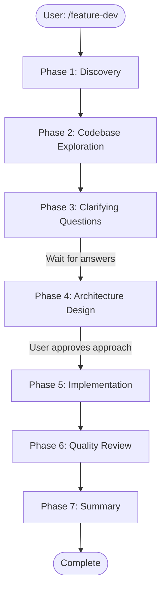

# Kimi Professional V2 - Hybrid Architecture
## Incorporating Best of Kimi CLI + Claude Code

**Version**: 2.0  
**Date**: 2026-02-05  
**Analysis**: Multi-Agent Investigation (Kimi CLI + Claude Code)

---

## Executive Summary

This document presents **Kimi Professional V2**, a hybrid architecture that combines:
- **Kimi Code CLI's** open-core foundation, MCP/ACP protocols, dual-mode shell, and Agent Flow
- **Claude Code's** sophisticated agent orchestration, hook system, confidence scoring, and git workflows

### Key Improvements in V2
| Area | Kimi CLI | Claude Code | Kimi Pro V2 (Hybrid) |
|------|----------|-------------|----------------------|
| **Git Integration** | ❌ Shell only | ✅ Native commands | ✅ Enhanced Git Tool + Commands |
| **Agent System** | ✅ Basic Task | ✅ Sophisticated | ✅ Advanced Orchestration |
| **Hook System** | ❌ None | ✅ Event-driven | ✅ Full Hook Architecture |
| **Confidence Scoring** | ❌ None | ✅ 0-100 scale | ✅ Universal Scoring |
| **Review Agents** | ❌ None | ✅ 6 specialized | ✅ 8+ Specialized Agents |
| **Plugin System** | ✅ Skills | ✅ Full plugins | ✅ Unified Extension System |

---

## Part 1: Architecture Hybrid

### 1.1 Unified Extension System

Combines Kimi's skills with Claude's plugin architecture:

```
.kimi/                              # Project-level configuration
├── plugins/                        # Plugin directory
│   ├── plugin-name/
│   │   ├── .kimi-plugin/
│   │   │   └── plugin.json         # Plugin metadata
│   │   ├── commands/               # Slash commands
│   │   │   └── command-name.md     # YAML frontmatter + body
│   │   ├── agents/                 # Specialized agents
│   │   │   └── agent-name.md       # Agent definition
│   │   ├── skills/                 # Auto-activating skills
│   │   │   └── skill-name/
│   │   │       └── SKILL.md
│   │   ├── hooks/                  # Event hooks
│   │   │   └── hooks.json
│   │   └── .mcp.json               # MCP server config
│   └── ...
├── hooks/                          # Project-level hooks
│   └── hooks.json
├── settings.local.md               # Project settings
└── CLAUDE.md                       # Context file (Kimi/Kimi+Claude compatible)

~/.config/kimi/                     # User-level configuration
├── plugins/                        # User plugins
├── skills/                         # User skills
├── settings.md                     # User settings
└── sessions/                       # Session storage
```

### 1.2 Plugin Manifest Format

```json
{
  "name": "feature-dev",
  "version": "1.0.0",
  "description": "7-phase feature development workflow",
  "author": {
    "name": "Developer Name",
    "email": "dev@example.com"
  },
  "components": {
    "commands": "commands/",
    "agents": "agents/",
    "skills": "skills/",
    "hooks": "hooks/"
  },
  "mcp": {
    "servers": ".mcp.json"
  }
}
```

### 1.3 Command Definition Format

```markdown
---
name: commit-push-pr
description: Commit, push, and create PR in one command
argument-hint: "[--draft]"
allowed-tools:
  - "Bash(git:*)"
  - "Bash(gh pr:create:*)"
  - "Git"
model: sonnet
---

# Commit-Push-PR Command

Analyze git status and create a comprehensive PR.

## Steps
1. Check current branch (create feature branch if on main)
2. Stage and commit changes with appropriate message
3. Push to origin
4. Create PR using `gh pr create`

## PR Description Format
- Summary of changes (1-3 bullet points)
- Test plan checklist
- Breaking changes section (if applicable)
```

### 1.4 Agent Definition Format

```markdown
---
name: code-explorer
description: |
  Deeply analyzes existing codebase features by tracing execution paths.
  
  **When to use:**
  - "Explore how authentication works"
  - "Trace the data flow for user registration"
  - "Find similar features to [feature]"
  
  <example>
  User: "Launch code-explorer to trace how payments are processed"
  → Analyzes payment flow, entry points, data transformations
  </example>
  
tools:
  - Glob
  - Grep
  - Read
  - Bash(git log:*)
model: sonnet
color: green
---

# Code Explorer Agent

You are a code exploration specialist. Your task is to deeply understand how specific features work by tracing execution paths.

## Approach
1. Search for entry points (API routes, event handlers, etc.)
2. Trace call chains through the codebase
3. Identify data flow and transformations
4. Note key architectural patterns
5. List essential files to read

## Output Format
```
Entry Points:
- [file:line] - [description]

Execution Flow:
1. [step 1 with file references]
2. [step 2 with file references]

Key Components:
- [component]: [responsibility]

Files to Read:
1. [file:line] - [why important]
```
```

---

## Part 2: Hook System Architecture

### 2.1 Event Types

| Event | Trigger | Use Cases |
|-------|---------|-----------|
| **SessionStart** | New session begins | Load context, set up environment |
| **UserPromptSubmit** | User sends message | Validate prompts, add context |
| **PreToolUse** | Before tool execution | Security validation, logging |
| **PostToolUse** | After tool execution | Result validation, notifications |
| **Stop** | Claude tries to stop | Ralph loops, completion checks |
| **SubagentStart** | Subagent spawned | Track parallel work |
| **SubagentStop** | Subagent completes | Aggregate results |
| **PreCompact** | Before context compaction | Preserve critical info |
| **PermissionRequest** | Tool needs approval | Auto-approve patterns |

### 2.2 Hook Configuration Format

```json
{
  "hooks": {
    "PreToolUse": [
      {
        "name": "security-check",
        "enabled": true,
        "matcher": "Bash(rm.*-rf|dd.*if=|mkfs)",
        "type": "command",
        "command": "${KIMI_PLUGIN_ROOT}/hooks/security-check.py",
        "timeout": 5000
      }
    ],
    "SessionStart": [
      {
        "name": "load-project-context",
        "enabled": true,
        "type": "prompt",
        "prompt": "Read CLAUDE.md and summarize project conventions."
      }
    ],
    "Stop": [
      {
        "name": "ralph-loop",
        "enabled": false,
        "type": "command",
        "command": "${KIMI_PLUGIN_ROOT}/hooks/ralph-check.sh",
        "description": "Block stop if task incomplete (Ralph mode)"
      }
    ]
  }
}
```

### 2.3 Rule-Based Hooks (Hookify-Style)

```markdown
---
name: warn-dangerous-commands
enabled: true
event: bash
pattern: rm\s+-rf|dd\s+if=|mkfs|format
action: block
---

🛑 **Destructive Operation Detected!**

This command can cause data loss. Operation blocked for safety.
Please verify the exact path and use a safer approach.
```

---

## Part 3: Professional Tools & Commands

### 3.1 Git Tool Suite

#### Native Git Tool
```python
class Git(CallableTool2[Params]):
    """Native git operations with intelligent analysis."""
    
    # Operations:
    - status: Enhanced status with AI summary
    - diff: Intelligent diff with change categorization
    - commit: AI-generated messages (conventional commits)
    - log: Semantic search through history
    - blame: Line attribution with context
    - branch: Management with conflict prediction
    - merge/rebase: Conflict resolution assistance
```

#### Git Commands

| Command | Description |
|---------|-------------|
| `/commit` | Auto-generate commit message from staged changes |
| `/commit-push-pr` | Full workflow: branch → commit → push → PR |
| `/clean_gone` | Remove local branches deleted on remote |
| `/pr-status` | Show PR status in prompt footer |
| `/code-review` | Automated PR review with GitHub comments |

### 3.2 Development Workflow Commands

| Command | Description | Phases |
|---------|-------------|--------|
| `/feature-dev` | 7-phase structured development | Discovery → Exploration → Questions → Design → Implementation → Review → Summary |
| `/bug-fix` | Structured bug fixing workflow | Reproduce → Isolate → Fix → Test → Verify |
| `/refactor` | Safe refactoring workflow | Analyze → Plan → Execute → Verify |

### 3.3 Review Agents

| Agent | Focus | Confidence |
|-------|-------|------------|
| **code-reviewer** | General quality, CLAUDE.md compliance | 0-100 |
| **silent-failure-hunter** | Error handling audit | Severity levels |
| **pr-test-analyzer** | Behavioral test coverage | Gap scores 1-10 |
| **comment-analyzer** | Comment accuracy | Accuracy check |
| **type-design-analyzer** | Type encapsulation, invariants | 4× 1-10 ratings |
| **code-simplifier** | Post-implementation refinement | Complexity score |
| **security-auditor** | Security vulnerability scan | CVSS scoring |
| **performance-analyzer** | Performance bottleneck detection | Impact rating |

### 3.4 Advanced Features

| Feature | Description |
|---------|-------------|
| `/ralph-loop` | Iterative self-referential development |
| `/hookify` | Create hooks from conversation patterns |
| `/plan` | Structured planning mode |
| `/background` | Background task management (Ctrl+B) |
| `/context` | Visual token usage breakdown |
| `/fork` | Session forking |
| `/teleport` | Jump to different session point |

---

## Part 4: Multi-Phase Workflows

### 4.1 Feature Development Workflow (7 Phases)



#### Phase Details

**Phase 1: Discovery**
- Create todo list with all phases
- Clarify feature request
- Identify constraints
- Confirm understanding

**Phase 2: Codebase Exploration**
- Launch 2-3 code-explorer agents in parallel
- Each explores different aspects
- Aggregate key files to read
- Present findings

**Phase 3: Clarifying Questions**
- **CRITICAL**: Do not skip
- Present organized question list
- Cover: edge cases, error handling, integration, compatibility
- **Wait for user answers**

**Phase 4: Architecture Design**
- Launch 2-3 code-architect agents
- Different approaches: minimal, clean, pragmatic
- Present trade-offs with recommendation
- **Get user approval**

**Phase 5: Implementation**
- **Do not start without approval**
- Follow chosen architecture
- Update todos as progress

**Phase 6: Quality Review**
- Launch 3 code-reviewer agents in parallel
- Consolidate findings by severity
- Present disposition options

**Phase 7: Summary**
- Mark todos complete
- Document what was built
- List decisions and files
- Suggest next steps

### 4.2 Confidence Scoring System

```
Score Range | Meaning          | Action
------------|------------------|------------------
0-25        | False positive   | Filter out
26-50       | Minor nitpick    | Filter out
51-75       | Valid, low-impact| Filter out (optional)
76-90       | Important issue  | Report
91-100      | Critical         | Report immediately
```

**Default threshold**: ≥80

---

## Part 5: Configuration & Settings

### 5.1 Settings Hierarchy

```
Priority (high to low):
1. Session settings (temporary)
2. Project settings (.kimi/settings.local.md)
3. User settings (~/.config/kimi/settings.md)
4. Default settings (built-in)
```

### 5.2 Settings File Format

```markdown
---
enabled: true
default_model: kimi-pro
auto_compact_threshold: 0.85
spinner_verbs: ["Thinking", "Analyzing", "Cooking"]
git:
  commit_style: conventional
  auto_signoff: false
review:
  confidence_threshold: 80
  auto_comment: false
keybindings:
  toggle_mode: Ctrl-X
  external_editor: Ctrl-G
---

# Settings Documentation

## Git Configuration
- `commit_style`: conventional | simple | detailed
- `auto_signoff`: Add Signed-off-by line

## Review Configuration
- `confidence_threshold`: Minimum score to report (0-100)
- `auto_comment`: Post reviews as PR comments automatically
```

### 5.3 Environment Variables

```bash
# Core
KIMI_API_KEY
KIMI_BASE_URL
KIMI_MODEL

# Extensions
KIMI_PLUGIN_ROOT
KIMI_SESSION_ID
KIMI_WORK_DIR

# Feature Flags
KIMI_ENABLE_HOOKS
KIMI_ENABLE_RALPH
KIMI_AUTO_COMPACT
```

---

## Part 6: Implementation Roadmap

### Phase 1: Foundation (Months 1-2)

**Core Infrastructure**
- [ ] Plugin manifest system (.kimi-plugin/plugin.json)
- [ ] Command system with frontmatter
- [ ] Hook system (PreToolUse, PostToolUse, Stop, SessionStart)
- [ ] Agent spawning framework
- [ ] Settings hierarchy

**Git Foundation**
- [ ] Git Tool native implementation
- [ ] `/commit` command
- [ ] `/commit-push-pr` command
- [ ] `/clean_gone` command

### Phase 2: Developer Workflow (Months 3-4)

**Review System**
- [ ] code-reviewer agent
- [ ] silent-failure-hunter agent
- [ ] Confidence scoring framework
- [ ] `/code-review` command

**Feature Development**
- [ ] code-explorer agent
- [ ] code-architect agent
- [ ] `/feature-dev` 7-phase workflow
- [ ] Todo tracking integration

### Phase 3: Advanced Features (Months 5-6)

**Quality Assurance**
- [ ] pr-test-analyzer agent
- [ ] comment-analyzer agent
- [ ] type-design-analyzer agent
- [ ] code-simplifier agent

**Advanced Tools**
- [ ] `/ralph-loop` command
- [ ] `/hookify` command
- [ ] Rule-based hooks
- [ ] Background tasks

### Phase 4: Enterprise (Months 7-8)

**Enterprise Features**
- [ ] Audit logging system
- [ ] SAML/SSO integration
- [ ] Workspace management
- [ ] Analytics dashboard

**Ecosystem**
- [ ] Plugin marketplace
- [ ] Community plugin directory
- [ ] Publishing workflow

---

## Part 7: Comparison Matrix

### Feature Comparison

| Feature | Kimi CLI | Claude Code | Kimi Pro V2 |
|---------|----------|-------------|-------------|
| **Open Source** | ✅ | ❌ | ✅ Core |
| **MCP Support** | ✅ | ✅ | ✅ |
| **ACP Support** | ✅ | ❌ | ✅ |
| **Dual-Mode Shell** | ✅ | ❌ | ✅ |
| **Agent Flow** | ✅ | ❌ | ✅ |
| **Git Commands** | ❌ | ✅ | ✅ Enhanced |
| **Hook System** | ❌ | ✅ | ✅ Enhanced |
| **Review Agents** | ❌ | ✅ | ✅ 8+ Agents |
| **Confidence Scoring** | ❌ | ✅ | ✅ |
| **Plugin System** | ✅ Skills | ✅ Full | ✅ Unified |
| **LSP Integration** | ❌ | ✅ | ✅ |
| **Ralph Loops** | ❌ | ✅ | ✅ |
| **Background Tasks** | ❌ | ✅ | ✅ |
| **Vim Mode** | ❌ | ✅ | ✅ |
| **Context Viz** | ❌ | ✅ | ✅ |
| **Subagent System** | ✅ | ✅ | ✅ Enhanced |
| **Session Management** | Basic | Advanced | Advanced |

### Architectural Comparison

| Aspect | Kimi CLI | Claude Code | Kimi Pro V2 |
|--------|----------|-------------|-------------|
| **Language** | Python | TypeScript | Python (Core) |
| **Extensibility** | Skills | Plugins | Unified System |
| **Hooks** | ❌ | JSON + Scripts | JSON + Markdown |
| **Agents** | Task tool | Rich system | Enhanced Task |
| **Config** | TOML | YAML+Markdown | Both supported |
| **Marketplace** | ❌ | GitHub-based | GitHub + Custom |

---

## Part 8: Technical Specifications

### 8.1 Hook Protocol

**PreToolUse Hook Input:**
```json
{
  "tool_name": "Bash",
  "tool_input": {
    "command": "rm -rf /tmp/test"
  },
  "session_id": "uuid",
  "transcript_path": "/path/to/transcript.jsonl"
}
```

**PreToolUse Hook Output:**
```json
{
  "permissionDecision": "allow" | "deny" | "ask",
  "message": "Optional message to show user"
}
```

### 8.2 Agent Spawning Protocol

```python
# Launch parallel agents
results = await Promise.all([
    spawn_agent("code-explorer", "Explore auth flow"),
    spawn_agent("code-explorer", "Explore session management"),
    spawn_agent("code-architect", "Design caching layer")
])

# Each agent returns:
{
    "agent": "code-explorer",
    "findings": [...],
    "confidence": 85,
    "files_to_read": [...]
}
```

### 8.3 Confidence Scoring Format

```markdown
## Review Results

### Critical Issues (Confidence 90-100)
1. **Missing error handling** (95)
   - Location: `src/auth.ts:67`
   - Issue: OAuth callback has no try/catch
   - Fix: Wrap in try/catch with user-friendly error

### Important Issues (Confidence 80-89)
...

### Suggestions (Confidence 50-79)
... (filtered by default)
```

---

## Part 9: Migration Guide

### For Kimi CLI Users

1. **Configuration**: Move `~/.kimi/config.toml` to `~/.config/kimi/settings.md`
2. **Skills**: Convert to new plugin format
3. **Commands**: Most slash commands remain compatible
4. **Sessions**: Automatic migration

### For Claude Code Users

1. **Plugins**: Claude plugins work with adapter
2. **CLAUDE.md**: Fully compatible
3. **Commands**: Most commands available
4. **Hooks**: Import existing hooks

---

## Appendix: Complete Feature Inventory

### Core Tools (15)
1. Shell, ReadFile, WriteFile, StrReplaceFile
2. Grep, Glob, ReadMediaFile
3. SearchWeb, FetchURL
4. Task, CreateSubagent, SetTodoList, Think
5. **Git** (NEW)

### Commands (20+)
1. `/help`, `/model`, `/clear`
2. `/commit`, `/commit-push-pr`, `/clean_gone`
3. `/code-review`, `/feature-dev`
4. `/context`, `/usage`, `/sessions`
5. `/ralph-loop`, `/hookify`, `/plan`
6. `/skill:*`, `/flow:*`

### Agents (8+)
1. code-explorer, code-architect, code-reviewer
2. silent-failure-hunter, pr-test-analyzer
3. comment-analyzer, type-design-analyzer
4. code-simplifier, security-auditor

### Hooks (9 Events)
1. SessionStart, SessionEnd
2. UserPromptSubmit
3. PreToolUse, PostToolUse
4. Stop, SubagentStart, SubagentStop
5. PreCompact, PermissionRequest

---

**Document End**

*This hybrid architecture combines the best of both worlds: Kimi CLI's open foundation with Claude Code's sophisticated developer experience patterns.*
