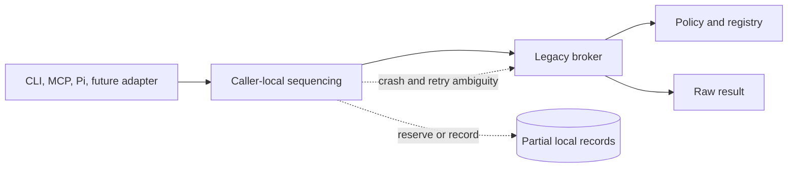
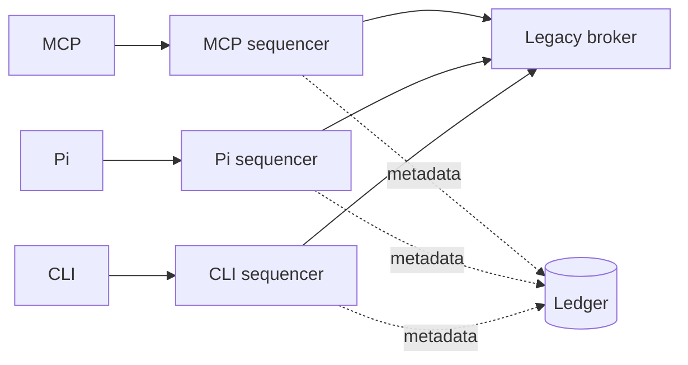
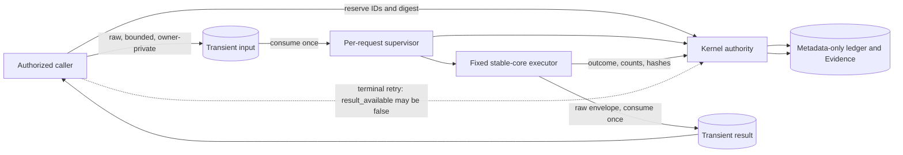
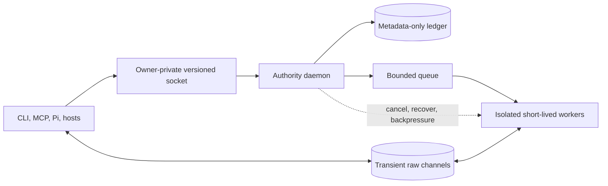

# Security Hardening Proposal: Centralize execution authority

## Decision

We select **Option 2, per-request kernel reservation and supervised fixed executor**, as the incremental architecture. Its implementation status is **in progress**. We reject caller-local sequencing as an end state and retain an owner-private daemon as a future foundational option.

## Executive Recommendation

We considered the complete set before choosing a direction: **Option 1, caller-local sequencing around the legacy broker**, preserves the smallest change but leaves authority split; **Option 2, per-request kernel reservation and supervised fixed executor**, centralizes durable authority without a resident service; and **Option 3, owner-private daemon with isolated workers**, offers a possible future service boundary at substantially higher lifecycle cost.

I recommend Option 2 under the current balanced constraints. We should make the control-plane kernel the sole durable authority for stable-core Run, ToolCall, policy, cancellation, and Evidence identity. A per-request supervisor should execute only the fixed reviewed adapter with fixed arguments, environment, bounds, and deadline. Raw tool input and raw stdout/stderr should cross only bounded owner-private transient channels and should never enter the ledger or Evidence.

This design deliberately provides at-most-once execution rather than guaranteed replay of raw results. When execution is already terminal but the consume-once result is gone, retry should return the durable outcome and `result_available=false`; it must not re-execute. This costs result availability after caller loss, but prevents duplicate effects and reduces durable sensitive-data exposure.

## Evidence

The exact source collection and hashes are recorded in [context.md](../context.md). The target revision is `ce0069e0e41c44ceae019e917da74c39efda587e`, and source drift is **present**.

I inspected the collected source rather than relying on an installed or release claim. E003 through E007 most influenced the structural diagnosis because they show both the intended kernel-owned boundary and the explicit choice not to replay a terminal call merely to recover raw output.

| Evidence | Finding or document | What it establishes |
|---|---|---|
| `E001` | [Public CLI fixed leaf and durable bridge](../../../../bin/mainframe) | **Observed:** `bin/mainframe:583-630,2855-2860` narrows the hidden leaf and fails closed before broad dispatch, but the bytes are drifting worktree source. |
| `E002` | [Bash durable bridge transport](../../../../lib/durable_invoke.sh) | **Observed:** `lib/durable_invoke.sh:48-66,124-138,177-350` bounds and cleans caller-side temporary transport; it is not installed proof. |
| `E003` | [Kernel identity and metadata receipt](../../../../control_plane/mainframe_control_plane/kernel.py) | **Observed:** `kernel.py:170-185,307-348,475-493,2475-2577` models canonical metadata, metadata-only receipts, transient result delivery, and interrupted recovery without replay. |
| `E004` | [Owner-private transient transport](../../../../control_plane/mainframe_control_plane/transient.py) | **Observed:** `transient.py:31-198` binds bounded consume-once raw input and result files to the durable request. |
| `E005` | [Fixed per-request executor](../../../../control_plane/mainframe_control_plane/executor.py) | **Observed:** `executor.py:57-104,179-454` fixes invocation and supervision bounds but is not an OS sandbox. |
| `E006` | [At-most-once worker](../../../../control_plane/mainframe_control_plane/worker.py) | **Observed:** `worker.py:47-139` refuses to retry running or terminal calls and publishes raw output only to transient transport. |
| `E007` | [Canonical retry/result contract](../../../../control_plane/mainframe_control_plane/cli.py) | **Observed:** `cli.py:245-317,347-433` binds correlation retry and separates terminal outcome from `result_available`. |
| `E008` | [Pending MCP and Pi callers](../../../../mcp/src/mainframe_mcp/executor.py) | **Observed:** `executor.py:623-726` and `skills/pi/extensions/mainframe.ts:2487-2567` still contain caller-specific invocation/envelope seams. |
| `E009` | [Conservative host evidence registry](../../../../config/host-capabilities.json) | **Observed:** `host-capabilities.json:44-65,69-124,143-215` keeps claims route-specific and does not infer non-shell enforcement. |
| `E010` | [Drifting stable-core coverage](../../../../tests/control_plane/test_stable_core.py) | **Observed:** `test_stable_core.py:147` expects a durable envelope while collected kernel source writes a metadata receipt, so the gate is not coherent yet. |
| `E011` | Split-authority crash condition | **Inferred from E001, E002, and E008:** caller-local reserve/invoke/record steps cannot eliminate every execution-versus-Evidence crash window. |
| `E012` | Possible resident authority | **Inferred from E003-E005:** a daemon could centralize queueing and lifecycle, but current evidence does not establish demand or isolated-worker support. |

## Current Design And Failure Mode

The legacy shape lets each caller sequence invocation around the broker. Even when every caller is careful, authority is split: the caller owns intent and retry, the broker owns execution, and another step owns durable recording. A crash or disconnect can leave the next process unable to distinguish “not executed” from “executed but result not recorded.” Retrying can duplicate work; refusing to retry can hide an outcome. Duplicated MCP, Pi, Bash, and future-host logic also lets policy and receipt semantics drift.

The current worktree is already moving toward a kernel-owned route, but it is not coherent completion proof. Some collected tests still model raw broker envelopes in durable Evidence, while the selected privacy model stores only a metadata receipt and makes the raw envelope consume-once. MCP and Pi still expose migration seams. We therefore describe this as an active implementation, not a fixed vulnerability or a completed remediation.

## Desired Invariants

1. The kernel creates and binds the stable-core reservation, Run, ToolCall, policy decision, and Evidence identities before or as execution advances.
2. The durable ledger and Evidence store canonical identity, input digest/shape metadata, outcome, exit metadata, byte counts, and output hashes—never raw input, stdout, or stderr.
3. Raw input and raw result use bounded owner-private channels, validate exact identity/digest bindings, and are consumed or deleted.
4. Only the fixed reviewed stable-core executable, command grammar, environment, workspace, timeout, and output bound can execute through this route.
5. A correlation identity is at most once: a running or terminal call is never automatically re-executed.
6. A terminal retry can report `result_available=false`; callers must surface that state and must not infer that no execution happened.
7. Cancellation and recovery are identity-bound. Lost-supervisor recovery records an interrupted terminal outcome rather than replaying the request.
8. Mixed-version, unknown-contract, malformed, unsafe-owner/mode, missing-transient, and binding-mismatch states fail closed.
9. Host claims remain route-specific. Shell interception does not authorize or prove non-shell enforcement.

## Constraints And Non-Goals

- Preserve the reviewed stable-core inventory and existing public CLI compatibility while migration is staged.
- Work on macOS and supported Linux/Bash environments without requiring a permanently running service for the incremental option.
- Bound input, output, time, process groups, and owner-private local artifacts.
- Do not persist raw inputs or outputs merely to make retries more convenient.
- Do not claim that `0700` directories or same-user Unix sockets defend against every compromised same-user process.
- Do not call the supervised subprocess a sandbox. Actual isolation is a separate platform-specific capability.
- Do not claim host-native file/network/process/MCP enforcement when only shell interception is evidenced.
- Do not treat source layout, a proposed test, or a passing unit test as installed/live/released evidence.

## Before Architecture

[Source diagram](../diagrams/centralize-execution-authority-before.mmd)

## Options

### Option 1: Local sequencing around the legacy broker

Each caller would perform best-effort reservation, invoke the legacy broker, and append its own record. This is the lowest-change baseline and is **rejected** as the target architecture.

The attractive part of Option 1 is compatibility: MCP, Pi, and the CLI can preserve their current process and output shapes, and rollback is simply a caller-local code reversal. A team facing an urgent narrow bug could reasonably keep these local guards as tactical containment. What gives me pause is that the option asks each adapter to solve a distributed commit problem without a transaction owner. No amount of careful ordering can make a caller crash after broker execution but before Evidence append unambiguous.

[Option 1 diagram](../diagrams/centralize-execution-authority-legacy-local-sequencing-after.mmd)

| Change | Before | After | Security consequence | Cost |
|---|---|---|---|---|
| Local reservation | Optional or caller-specific | Added independently to each caller | Narrows accidental unrecorded calls but preserves split authority | Duplicated adapter state machines |
| Fixed broker grammar | Broad caller-controlled invocation | Each caller targets the reviewed leaf | Reduces command-shape abuse | Compatibility work per caller |
| Retry handling | Caller-dependent | Best-effort local reconciliation | Crash ambiguity remains | More diagnostics without a definitive owner |

The diagram's repeated sequencers are the decisive edge: the code can look consistent and still drift because there is no single component that owns both terminal execution identity and Evidence. We could roll this out caller by caller, but a rollback would merely restore the previous local path, not restore a stronger invariant.

- **Security:** Authority remains duplicated. Execution can occur outside the process that durably records it, leaving a trust and crash gap.
- **Performance:** Lowest added latency and fewest filesystem/process hops.
- **Memory:** Lowest steady-state and per-call footprint.
- **Reliability:** Weakest. Recovery cannot always distinguish never-started, running, and executed-but-unrecorded states, so replay safety is ambiguous.
- **Operability:** Familiar at first, but every adapter needs independent diagnostics, cancellation, reconciliation, and drift control.
- **Migration:** Easiest short-term and easiest to roll back, but it preserves the reason for this hardening opportunity.

We would still require tactical input/output bounds, fixed broker grammar, fail-closed policy checks, and conservative host claims while any legacy caller remains. Those controls reduce exposure but do not make this option acceptable as the end state.

### Option 2: Per-request kernel reservation and supervised fixed executor

The public route reserves a correlation-bound canonical request in the kernel, stages normalized raw input in a bounded owner-private consume-once channel, and launches a short-lived worker. The worker creates or resumes the kernel-owned call, obtains the canonical policy decision, invokes only the fixed stable-core adapter under a clean bounded supervisor, writes metadata-only Evidence, and publishes the raw envelope through a separate bounded consume-once result channel.

This option is **selected**, and its implementation is **in progress**.

The strongest case for Option 2 is that it concentrates exactly the state needed for replay safety without creating a resident service. The kernel can decide whether a correlation is new, running, or terminal; the worker can execute only the pre-bound request; and Evidence can remain useful without retaining sensitive raw values. The main price is one more process and durable synchronization per call, plus a caller-visible result-availability state that existing integrations must learn.

[Option 2 diagram](../diagrams/centralize-execution-authority-supervised-kernel-after.mmd)

| Change | Before | After | Security consequence | Cost |
|---|---|---|---|---|
| Durable authority | Split across callers and broker | Kernel owns reservation, policy, terminal identity, and Evidence | Removes caller-local execution/Evidence ambiguity | Ledger synchronization and a larger trusted kernel |
| Raw-value handling | Caller/broker paths can retain envelopes | Bounded owner-private consume-once channels | Reduces durable sensitive-data exposure | Raw result can be unavailable after loss or consumption |
| Execution | Caller launches broker | Fixed supervisor owns executable, argv, env, deadline, and process group | Narrows command and lifecycle authority | Per-request spawn and bounded capture overhead |
| Retry | Caller decides whether to replay | Running/terminal correlation never re-executes | Prevents duplicate execution | Terminal retry may return `result_available=false` |

The changed edge is the separation between durable proof and transient payload. We retain enough metadata to reconcile what executed, but we refuse to make the ledger a raw-output cache. That is why an unavailable result is terminal rather than a replay signal. We can roll this out behind the public CLI and then migrate adapters; rollback must stop the new route or restore a reviewed release, never silently fall back to the legacy broker.

- **Security:** Exact identity, policy, execution bounds, and Evidence converge in the kernel. Durable privacy improves because raw inputs and stdout/stderr are excluded. Residual same-user IPC risk remains, and supervision is not sandbox isolation.
- **Performance:** Every call pays ledger synchronization, transient-file, worker-spawn, and supervision costs. These should be benchmarked against the stable-core timeout budget.
- **Memory:** Per-call memory is bounded by input/output limits and short-lived worker state. There is no permanent service footprint.
- **Reliability:** At-most-once is explicit. A terminal call is never re-executed merely because its raw result was consumed or lost. The tradeoff is reduced result availability: retries can return the durable outcome with `result_available=false`.
- **Operability:** Durable IDs, outcome receipts, cancellation, and recovery improve diagnosis. Operators and callers must understand the distinction between durable execution evidence and a transient raw result.
- **Migration:** The route can land behind the public CLI, then MCP and Pi can migrate. During mixed states, direct legacy seams, contract drift, and unknown caller behavior must fail closed.

This is the smallest option that establishes a defensible control-plane authority without adding a resident service. It also makes the privacy/reliability decision explicit: raw replay is intentionally weaker than durable metadata replay. A caller that receives `result_available=false` may reconcile using outcome, IDs, counts, and hashes, or request human direction; it must not silently execute again.

### Option 3: Owner-private daemon with isolated workers

A versioned owner-private local service would own reservation, policy, dispatch, cancellation, recovery, and metadata Evidence. Clients would connect through an authenticated local socket, while each execution would run in a short-lived isolated worker with capability-limited IPC and the same non-persistent raw-value boundary.

This is a **future foundational** option, not current implementation.

The appealing part of Option 3 is a durable authority that can coordinate multiple simultaneous clients, apply backpressure, and own worker health without per-call kernel startup. It should win if measurements show sustained concurrency or startup cost that Option 2 cannot meet, or if the threat model demands isolation primitives that fit better behind a service. Today, however, “isolated workers” is a desired property rather than observed code, and a daemon adds a high-value same-user target plus permanent install and upgrade obligations.

[Option 3 diagram](../diagrams/centralize-execution-authority-owner-private-daemon-after.mmd)

| Change | Before | After | Security consequence | Cost |
|---|---|---|---|---|
| Authority lifetime | Per caller/request | Resident owner-private service | Reduces client authority and centralizes policy | High-value daemon and availability dependency |
| Dispatch | Uncoordinated caller starts | Bounded daemon queue and workers | Enables centralized backpressure | Queue saturation and recovery design |
| Isolation | Fixed process supervision only | Intended platform-isolated workers | Could narrow executor compromise | Platform-specific implementation and proof |
| Protocol | Public CLI/process boundary | Versioned private IPC | Can authenticate and close requests centrally | Client/server skew and upgrade complexity |

This diagram introduces several components that do not exist in the observed before state, so each edge needs independent proof. A responsible rollout would begin as an opt-in prototype with dual-version compatibility and crash/upgrade campaigns. Rollback must leave the metadata state readable by Option 2 and must not reactivate caller-local execution.

- **Security:** Potentially strongest single local authority and least caller trust, provided peer identity, binary integrity, IPC authorization, and real worker isolation are proven. An owner-private socket alone is insufficient.
- **Performance:** Amortizes kernel startup and may handle concurrency better, but adds IPC and isolation costs.
- **Memory:** Highest steady-state footprint due to the resident service, queue, health state, and concurrent worker metadata.
- **Reliability:** Central ownership can improve backpressure and reconciliation, while daemon crashes, upgrades, stale sockets, and split client/server versions create new failure modes.
- **Operability:** Requires installation, launch lifecycle, health checking, logging/privacy policy, upgrades, recovery, and platform-specific service integration.
- **Migration:** Largest change. It needs a versioned protocol, dual-route period, package/install support, safe state adoption, and a proven rollback path.

We should revisit this option only after measurement shows that per-request startup, concurrency, or multi-client lifecycle requirements justify the permanent operational surface.

## Comparison

| Dimension | Option 1: Local sequencing | Option 2: Supervised kernel | Option 3: Private daemon |
|---|---|---|---|
| Security | Local guards help, but authority remains split | Kernel-owned identity/Evidence and fixed execution; no sandbox | Potentially strongest if IPC and isolation are proven |
| Performance | Fewest new hops | Adds fsync, transient I/O, and worker spawn | Amortizes kernel startup but adds IPC/queue/isolation |
| Memory | Lowest | Bounded per-request worker and capture | Highest resident and concurrent-worker footprint |
| Reliability | Ambiguous crash/retry boundary | At most once; raw result may be unavailable | Central recovery/backpressure, plus daemon failure modes |
| Operability | Duplicated caller diagnostics | Durable IDs and reconciliation, no resident service | Service install, health, upgrade, and recovery burden |
| Migration | Smallest immediate change | Staged public CLI, MCP, then Pi migration | Versioned IPC and dual-route migration for every client |

The comparison favors Option 2 because the dominant constraint is trustworthy execution authority, not maximum throughput. Option 1 is cheaper only by leaving that constraint unmet. Option 3 may become proportionate if measurements or a stronger isolation threat model outweigh its permanent operational surface.

## Recommendation

I recommend Option 2. It directly addresses the observed split authority while preserving a local CLI product and avoiding premature daemon operations. The current worktree contains important parts of this design, but the honest gate remains open: source drift is present, old tests and adapters remain, and no clean revision or installed route has been proven by this portfolio.

We explicitly accept the selected reliability/privacy tradeoff. Durable Evidence proves identity, outcome, counts, and hashes; it does not become a store for raw tool input or output. When the transient result cannot be delivered, `result_available=false` is a valid terminal response. Re-executing would violate the stronger at-most-once invariant.

## Evidence Coverage And Residual Risk

Option 2 covers `E003 — kernel identity and metadata receipt`, `E004 — owner-private transient transport`, `E005 — fixed per-request executor`, `E006 — at-most-once worker`, `E007 — canonical retry/result contract`, and preserves `E009 — conservative host evidence registry`. It does not yet close `E008 — pending MCP and Pi callers`, `E010 — drifting stable-core coverage`, or the installed/release evidence gap.

Residual risk remains:

- A malicious process running as the same owner may be able to race or interfere with owner-private local IPC within the user's authority boundary.
- The fixed subprocess executor constrains invocation but does not provide platform sandboxing or syscall isolation.
- Losing a transient result sacrifices raw-result availability; callers need safe reconciliation UX.
- A bug in the kernel or reviewed stable-core contract remains within the trusted computing base.
- Host-native non-shell routes remain outside this authority unless separately intercepted and evidenced.
- Mixed installed versions can recreate drift unless compatibility and integrity gates fail closed.

## Migration And Rollout

1. Freeze the canonical stable-core contract and kernel identity/receipt schema at one source revision.
2. Make the public Bash route enter only the canonical kernel reservation and fixed executor seam; retain the hidden broker grammar solely as the kernel's fixed leaf.
3. Prove ledger privacy, transient artifact ownership/bounds/deletion, fixed invocation, terminal recovery, and result-unavailable retry semantics.
4. Migrate MCP to the public kernel-owned result contract, replacing adapter-local durable-looking correlation with returned Run/ToolCall/Evidence identities.
5. Migrate Pi to the same contract and remove its broker-envelope authority logic.
6. Fail closed for legacy direct routes, unknown callers/contracts, source/version mismatch, unsafe paths/modes, and missing or mismatched transient input.
7. Run clean-checkout cross-platform tests, then installed candidate tests. Promote live/released claims only with the separate qualifying receipt and release attestation.
8. Remove compatibility code only after a rollback window and telemetry-free local reconciliation checks establish that no supported caller needs it.

Rollback should disable the new route or restore a previous signed/reviewed release, not silently fall back from a failed kernel binding to direct broker execution. During rollback, stable-core mutation should stop if only the rejected unsafe route is available.

## Validation Plan

- Schema/identity: exact closed request/result fields; stable canonical IDs; collision/replay and mismatched actor/workspace/policy/input rejection.
- Privacy: scan every durable event and Evidence body to prove raw input, raw stdout, raw stderr, broker envelope, and secret sentinel values are absent; verify only digest/shape, counts, hashes, and outcome persist.
- Transient transport: owner, mode, non-symlink, single-link, maximum size, atomic replace, consume-once, cleanup on success/failure/cancel/timeout, and tamper rejection.
- At-most-once: crash before call creation, during policy, after process spawn, after terminal Evidence, before result consumption, after result consumption, and on caller retry. Assert execution counter remains one and terminal retry may report `result_available=false`.
- Supervisor: fixed executable identity, exact argv, clean environment, fixed workspace binding, bounded capture, durable timeout, explicit cancel, process-group termination, and no surviving child.
- Adapter migration: MCP and Pi use the kernel-owned route and returned identities; no legacy direct execution or adapter-local authority remains.
- Conservative claims: non-shell and release evidence remain unverified absent qualifying interception/live/release receipts.
- Cross-platform: Bash 4.4/Linux and supported macOS tests on one clean source revision, followed by installed-candidate validation.
- Negative compatibility: mixed-version, tampered executable, unsafe ledger/runtime directories, unavailable transient input, duplicate correlation with different input, and unavailable control plane all fail closed.

## Implementation Work Packages

1. **Contract freeze:** close canonical request/result/receipt schemas and document the `result_available=false` terminal state.
2. **Durable privacy:** make all canonical ledger and Evidence writes metadata-only and add secret-sentinel scans.
3. **Transient channels:** finish bounded owner-private input/result staging, consume-once semantics, deletion, and tamper tests.
4. **Supervisor lifecycle:** complete fixed execution, cancellation, deadline, process-tree cleanup, and lost-worker recovery without replay.
5. **Public route:** finish the Bash bridge and remove or fail-close all alternate stable-core execution branches.
6. **MCP migration:** use the kernel-owned route and report durable IDs only when returned by it.
7. **Pi migration:** use the same route and remove caller-local envelope authority.
8. **Conformance and release gates:** reconcile drifting tests; pass clean revision, installed candidate, live-host, and release gates separately.

The ordered, testable detail is in [implementation/supervised-kernel.md](../implementation/supervised-kernel.md).

## Open Questions

1. Should an unconsumed transient result expire immediately when the foreground caller exits, or after a short bounded owner-private grace period?
2. What exact user-facing message and exit status should accompany a terminal `result_available=false` outcome?
3. Is a compromised same-user process in scope now, and if so, which platform primitives can materially improve transient IPC isolation?
4. Does Evidence need a keyed authenticity mechanism beyond owner-private append-only storage and hash chaining?
5. What concurrency, latency, or multi-client threshold would trigger reevaluation of the daemon option?
6. How long must legacy read-only compatibility remain before its code can be removed without creating a silent fallback?
